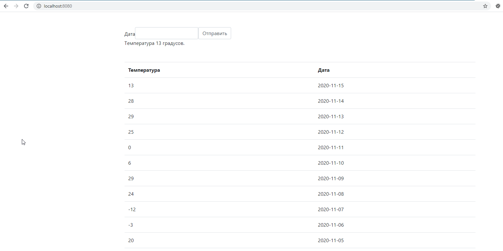

## JSON-RPC 2.0

### Run app
```docker-compose up```

### Run migrate and seed
```docker-compose exec weather_history bash -c 'php artisan migrate:fresh --seed'```

### Run tests
```docker-compose exec weather_history bash -c './artisan test'```

###### URL http://localhost:8080/



